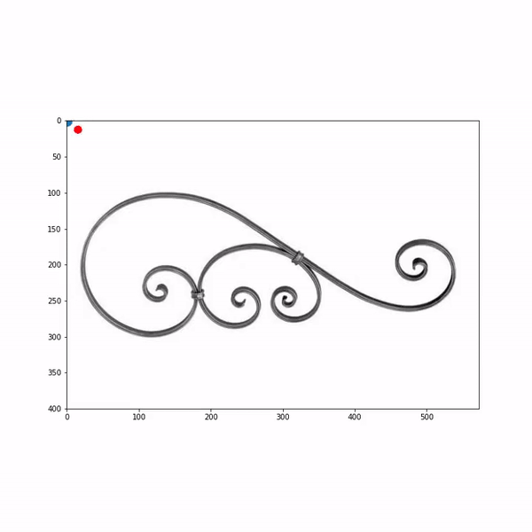
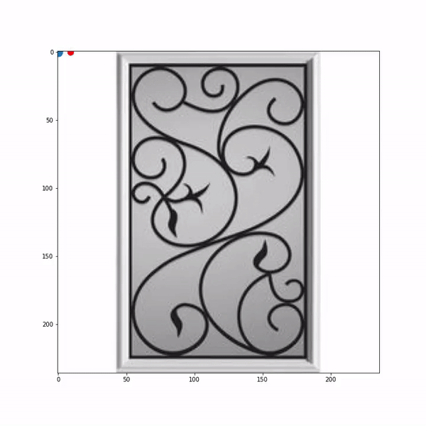

## saeb portfolio

I am a computer engineer, I have an interest in computer vision and machine learning, here are some projects I have worked on I hope you will like it


## Path extraction algorithm from an image for CNC machines

CNC machines are characterized by high precision and accuracy but require experts to work with, in this project we make it easy to handle it 

* we design algorithm to generate path from the images so you dont have to write code for it
* no matter how much the shape is complex the algorith can genarate a good path 
* it can be used for different types of CNC machines such as painting and drilling 

Here are some excellent results of the project 




## image colorization using deep learning

ggggggggggggggggggggggggggggggggggggggggggggggggggg


### Markdown

Markdown is a lightweight and easy-to-use syntax for styling your writing. It includes conventions for

```markdown
Syntax highlighted code block

# Header 1
## Header 2
### Header 3

- Bulleted
- List

1. Numbered
2. List

**Bold** and _Italic_ and `Code` text

[Link](url) and 
```

For more details see [GitHub Flavored Markdown](https://guides.github.com/features/mastering-markdown/).

### Jekyll Themes

Your Pages site will use the layout and styles from the Jekyll theme you have selected in your [repository settings](https://github.com/saebswaity/saeb_portfolio/settings/pages). The name of this theme is saved in the Jekyll `_config.yml` configuration file.

### Support or Contact

Having trouble with Pages? Check out our [documentation](https://docs.github.com/categories/github-pages-basics/) or [contact support](https://support.github.com/contact) and we’ll help you sort it out.
